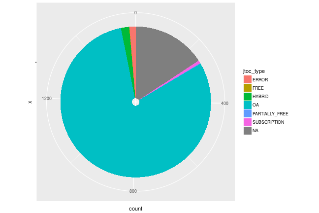

[Leipzig University Library](https://www.ub.uni-leipzig.de/) supports publication in Open Access journals through its [publication fund](https://www.ub.uni-leipzig.de/open-access/publikationsfonds/). The fund is supported by the DFG under its [Open-Access Publishing Programme](http://www.dfg.de/en/research_funding/programmes/infrastructure/lis/funding_opportunities/open_access_publishing/index.html).

[Leipzig University Library](https://www.ub.uni-leipzig.de/) has joined [openapc.github.io](https://openapc.github.io)  and made its expenditures for Open Access publications in peer-reviewed journals available for others to re-use.

Contact person is [Dr. Astrid Vieler](https://www.ub.uni-leipzig.de/recherche/fachseiten/veterinaermedizin/).

### Cost data

The data-set covers publication fees for 60 articles paid in 2014 and this year. Total expenditure was 79602.89€ and the average fee paid 1326.7€.

The following table shows the payments made to each publisher including taxes

|                                  | Articles| Fees paid in EURO| Mean Fee paid|
|:---------------------------------|--------:|-----------------:|-------------:|
|Springer Science + Business Media |       24|          35975.18|       1498.97|
|Public Library of Science (PLoS)  |       18|          21546.00|       1197.00|
|Frontiers Media SA                |        5|           6554.40|       1310.88|
|Oxford University Press (OUP)     |        2|           3515.26|       1757.63|
|Hindawi Publishing Corporation    |        2|           2182.64|       1091.32|
|Wiley-Blackwell                   |        1|           1344.70|       1344.70|
|Thieme Publishing Group           |        1|            976.22|        976.22|
|S. Karger AG                      |        1|           1130.50|       1130.50|
|Nature Publishing Group           |        1|           1999.20|       1999.20|
|Medknow                           |        1|            379.49|        379.49|
|MDPI AG                           |        1|            411.45|        411.45|
|Elsevier BV                       |        1|            340.74|        340.74|
|Co-Action Publishing              |        1|           1332.80|       1332.80|
|AIP Publishing                    |        1|           1914.31|       1914.31|

### Fees paid per publisher

 

###  Average costs per year

 

###  Average costs per publisher

 
